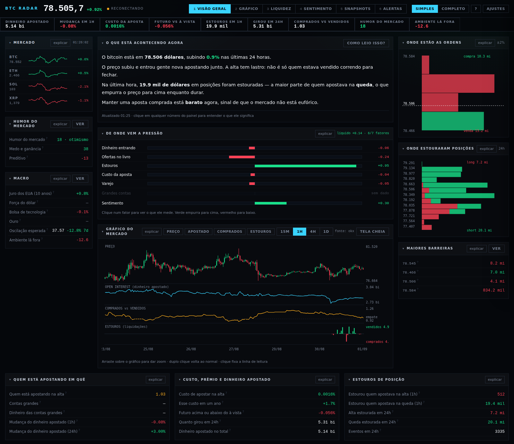

# BTC RADAR

Painel local de mercado futuro de bitcoin. Um servidor Node serve uma página única e faz proxy das
exchanges; a página é um cockpit estilo terminal, com preço ao vivo, open interest por exchange,
liquidações, mapa do livro, leitura de sentimento e uma nota preditiva por fórmula.

Roda em `localhost:8899`. Sem banco de dados (arquivos `.jsonl`), sem framework, sem build,
**sem nenhuma dependência npm**. Só Node 22 ou maior — é dele que vêm o `fetch` e o `WebSocket`
globais que o projeto usa.



*Visão geral no modo simples. Neste print a Binance está bloqueada por região, então preço, open
interest e a série do gráfico vêm da OKX — o painel diz a fonte em vez de ficar vazio.*

## Como rodar

### Linux Mint

O `apt` do Mint entrega Node 18 ou 20, e nenhum dos dois tem `WebSocket` global. Use o nvm:

```bash
curl -o- https://raw.githubusercontent.com/nvm-sh/nvm/v0.40.1/install.sh | bash
# feche e abra o terminal
nvm install 22
nvm use 22

git clone https://github.com/ersou-tech/Bitcoin-Cockpit.git BTC-RADAR
cd BTC-RADAR
npm start
```

Abra <http://127.0.0.1:8899>.

Atalho pronto:

```bash
chmod +x start.sh
./start.sh          # sobe em segundo plano se a porta estiver livre e abre o navegador
```

Para o menu do Mint, copie `linux/btc-radar.desktop` para `~/.local/share/applications/`
e troque `SEU-USUARIO` pelo caminho real.

### Coletar mesmo com o painel fechado (systemd de usuário)

O histórico e as liquidações só existem enquanto o servidor está de pé. Para deixar rodando:

```bash
mkdir -p ~/.config/systemd/user
cp linux/btc-radar.service ~/.config/systemd/user/
# ajuste WorkingDirectory e ExecStart (caminho do node do nvm) dentro do arquivo
systemctl --user daemon-reload
systemctl --user enable --now btc-radar.service
loginctl enable-linger "$USER"     # segue rodando sem sessão aberta
journalctl --user -u btc-radar -f  # acompanhar o log
```

### Windows

Node 22 do <https://nodejs.org>, depois `npm start`, ou os lançadores da pasta `windows/`:
`start.ps1` (PowerShell) e `start.vbs` (abre sem piscar janela de console).

### Testes

```bash
npm test                      # sobe o servidor e bate em /api/history, /api/fng e /api/preditivo
BTCR_SEM_REDE=1 npm test      # pula o que depende de internet
```

## Chave da IA

Na primeira abertura o painel pergunta a chave do Gemini. Ela é gravada em `data/config.json`
(que está no `.gitignore`), fica só na sua máquina e **nunca é devolvida ao navegador** — a rota
`/api/config` só informa se existe ou não.

Sem chave, o painel funciona inteiro; só os dois blocos de análise por IA (notícias e Fed) ficam
desligados. Dá para pegar uma chave gratuita em <https://aistudio.google.com/apikey>.

Se preferir não gravar segredo em arquivo, o ambiente vence o `config.json`:

```bash
GEMINI_KEY=sua-chave npm start
```

## De onde vem cada dado

| Bloco | Fonte |
|---|---|
| Preço ao vivo, trades | Bybit WebSocket `wss://stream.bybit.com/v5/public/linear` |
| Mark, funding, basis, volume | Binance `premiumIndex` + ticker spot; OKX como reserva quando a Binance não responde |
| Série do gráfico (velas, OI, long/short) | Binance; OKX (`candles`, `rubik/stat/contracts/*`) como reserva onde a Binance responde 451 |
| Open interest | Binance `openInterestHist`, Bybit `/v5/market/open-interest`, OKX `open-interest` (campo `oiCcy`), Hyperliquid `POST /info {"type":"metaAndAssetCtxs"}` |
| Long/short | Binance `globalLongShortAccountRatio`, `topLongShortPositionRatio`, `topLongShortAccountRatio` |
| Livro / muros | Binance `depth`, Bybit `orderbook`, OKX `books` (somados no painel, dentro de ±2%) |
| Liquidações | Bybit por WebSocket no servidor, OKX `liquidation-orders` (REST, 20s) e Gate.io `liq_orders` (REST, 20s) |
| Medo e ganância | `alternative.me/fng` (60 dias) |
| Notícias | RSS de CNBC (economia e finanças), MarketWatch, BBC Business, Yahoo Finance, InfoMoney, CoinDesk, Cointelegraph, The Block, Decrypt, Bitcoin Magazine |
| Fed | RSS `press_monetary.xml` e `speeches.xml`, com o texto extraído do bloco `id="article"` do documento interno |
| Análise de notícias e do Fed | Gemini (`gemini-3.6-flash` por padrão), chamado só pelo servidor |
| Apostas de juro | Polymarket Gamma API, filtrada para a próxima reunião do FOMC |
| Macro | Yahoo Finance chart API: ^TNX, DX-Y.NYB, ^IXIC, GC=F, BTC-USD |
| Volatilidade | Deribit DVOL |

Reuters e AP bloqueiam robô (403) e ficaram de fora de propósito.

## Estrutura

```
server.js      HTTP: estáticos + proxy com cache + rotas /api + coletores
sentiment.js   Fear & Greed, notícias por RSS, documentos do Fed, chamada ao Gemini
preditivo.js   Polymarket, Yahoo Finance, Deribit DVOL, nota preditiva por fórmula
snapshots.js   captura/lista/apaga snapshots, exporta CSV
backup.js      cópia .gz de data/ para backups/ com rotação de 14
index.html     interface inteira (HTML + CSS + JS puro, canvas nos gráficos)
data/          history.jsonl, liquidations.jsonl, snapshots.jsonl, sentiment.jsonl, config.json
backups/       cópias .gz, a cada 6h
linux/         serviço systemd de usuário e atalho .desktop
windows/       start.ps1 e start.vbs
test/          teste de fumaça
```

`data/` e `backups/` estão no `.gitignore`. O que é versionado é `data/config.example.json`.

### Rotas

`/px/<alvo>/<caminho>` — proxy com cache em memória (alvos: `binance`, `spot`, `bybit`, `okx`, `hl`).
TTL por tipo de rota: livro 3s, open interest 25s, liquidações 15s, klines/ticker 10s, resto 8s.
Se a exchange falhar e existir resposta velha em cache, a velha é devolvida — o painel não pode
zerar quando a exchange oscila.

`/api/history?hours=` · `/api/liq?hours=` (GET e POST) · `/api/fng` · `/api/sentiment` ·
`/api/sentiment/analise?kind=noticias|fed` · `/api/preditivo` · `/api/snapshot` (GET, `&formato=csv`, POST) ·
`/api/snapshot/apagar` · `/api/backup` (GET status, POST força) · `/api/config` (GET/POST).

### Atalhos

`1` a `6` trocam de view, `S` salva snapshot, `R` recarrega. As preferências (view, timeframe,
idioma, alertas) ficam no `localStorage` com prefixo `btcr-`.

## A interface

Seis views, trocadas pelos números **1** a **6** ou pelas abas. A faixa de métricas embaixo do
preço mostra os números do momento; clicar em qualquer um deles abre a explicação.

### Modo simples e modo completo

O botão no canto superior direito troca a linguagem do painel inteiro.

No **modo simples** (o padrão) os rótulos são em português comum — "custo de apostar na alta" no
lugar de *funding*, "dinheiro apostado" no lugar de *open interest*, "estouro de posição" no lugar
de *liquidação* — e os indicadores mais técnicos ficam escondidos. O **modo completo** devolve os
nomes de mercado e todos os blocos. A escolha fica gravada no navegador.

### Explicação em todo lugar

Todo número tem um `?` discreto e abre uma gaveta lateral com três coisas: **o que é**, **como ler**
e **como está agora** — esta última calculada com o dado do momento, não um texto genérico. A tecla
**G** abre o glossário completo; de dentro dele dá para pular para qualquer outro termo.

### O que dá para fazer

- **O que está acontecendo agora**: quatro a cinco frases em português montadas a partir dos dados,
  no topo da visão geral. É o resumo que dispensa saber jargão.
- **Painéis recolhíveis**: clique no título para fechar. O que você fechar continua fechado na
  próxima abertura.
- **De onde vem a pressão**: uma barra por fator (dinheiro entrando, ofertas no livro, estouros,
  custo da aposta, varejo, contas grandes, sentimento). Clique num fator para ler o que ele mede.
  Fator sem fonte disponível aparece apagado com "sem dado" — não vira zero, e não entra na média.
- **Gráfico**: quatro faixas dividindo o mesmo eixo de tempo. Passe o mouse para ler os quatro
  valores do mesmo instante, **clique para fixar** a linha de leitura, **arraste para dar zoom**,
  **duplo clique** volta. Os botões em cima ligam e desligam cada faixa.
- **Manchetes** têm filtro por texto; **snapshots** têm tabela ordenável por qualquer coluna.
- Atalhos: `1`–`6` views, `←` `→` passa de view, `S` salva snapshot, `R` recarrega, `F` gira o
  timeframe, `G` glossário, `?` lista de atalhos, `Esc` fecha.

O layout tem três quebras: três colunas acima de 1560px, duas até 1180px e uma coluna abaixo disso.

## Snapshots

A captura é **manual** (`snapshotMin: 0`). Open interest, livro e liquidações de um snapshot vêm
sempre do servidor, mesmo quando o navegador tem números próprios: série de estudo só vale se toda
linha for medida do mesmo jeito. O que o painel enxerga a mais (livro somado de três exchanges,
muros, termômetro) vai separado em `snap.painel`. O CSV sai com ponto e vírgula.

## Limitações honestas

- **Binance não entra nas liquidações.** O stream de futuros não entrega mensagem em várias
  regiões, não existe REST público de liquidação agregada e o arquivo `liquidationSnapshot` saiu
  do ar. Então o total de liquidações aqui é menor que o de sites que estimam o que falta. Preferimos
  faltar dado a inventar número — e isso está escrito na própria interface.
- **Os pesos do termômetro** (Fear & Greed 30%, notícias 25%, Fed 25%, preditivo 20%) e os
  **coeficientes do preditivo** são julgamento do autor. Não saíram de backtest. Servem para
  organizar a leitura, não para prever preço.
- **Parsers de RSS e de HTML quebram calados** quando o site muda de formato. Quando uma fonte cai,
  o painel mostra quais falharam — mas uma mudança silenciosa de layout no site do Fed pode fazer
  o texto extraído virar outra coisa sem aviso.
- **A leitura por IA é uma leitura**, com as limitações de sempre: pode errar ênfase, pode perder
  contexto, e o modelo gratuito devolve 503/429 com frequência (há repetição com espera, mas ela
  também pode acabar falhando).
- **A reserva pela OKX não é idêntica à Binance.** Onde a Binance está bloqueada, o painel troca
  para a OKX e escreve a fonte no cabeçalho do gráfico. Long/short de "grandes contas" e "grandes
  posições" só existe na Binance: sem ela, esses fatores ficam marcados como sem dado.
- **Delta de open interest depende de histórico.** Nas primeiras horas de uso o servidor ainda está
  enchendo o `history.jsonl`; o painel contorna lendo a série da Binance direto, mas se a Binance
  estiver bloqueada na sua região esse número demora a aparecer.
- **Isto não é recomendação de investimento.** É um painel de leitura de mercado, e nada aqui
  sugere comprar, vender ou segurar nada.

## Licença

MIT — veja [LICENSE](LICENSE).
